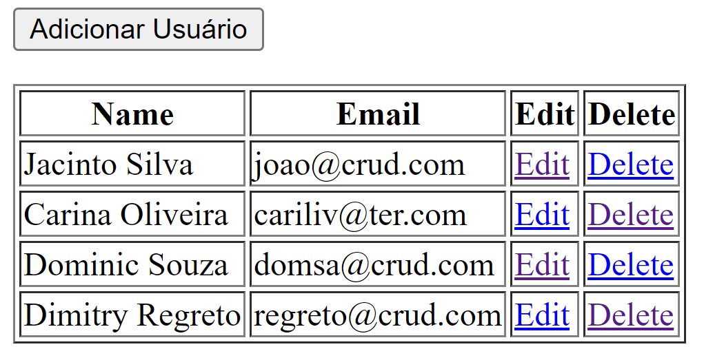

<p align="center"></p>

<p align="center"> 


</p>

# Crud py
Exemplo de uso de Python + Flask + MySQL + Docker
<br>
Este projeto tem o objetivo de ser um exmeplo de como montar um CRUD simples com retorno de uma interface WEB utilizando Python com o microframework Flask.

## 🔨 Funcionalidades

- `Python+Flask`: Neste exemplo escolhemos essas tecnologias
- `MySQL`: Já temos uma instância para banco de dados com dados populados de exemplo
- `Docker`: Sem comentários :-)

## Pré-requisitos
É necessário ter Docker, Docker Compose e Python instalados e rodando na máquina.

## Instalando dependências
```shell
pip install flask
pip install flask_table
pip install flask-mysql
```

## Subindo o container MySQL
```shell
docker compose up -d
```

## Iniciando Servidor
```shell
flask --app crud_py/main run
```

## Finally Running in Browser
http://127.0.0.1:5000/

<p align="center"></p>

# creditos
(em 2023) https://github.com/brenordv/dockerfile_preloaded_mysql 

(em 2023) https://roytuts.com/python-web-application-crud-example-using-flask-and-mysql
